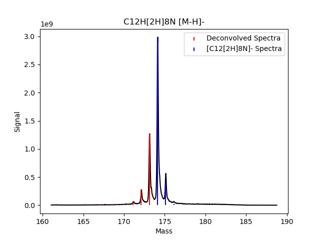
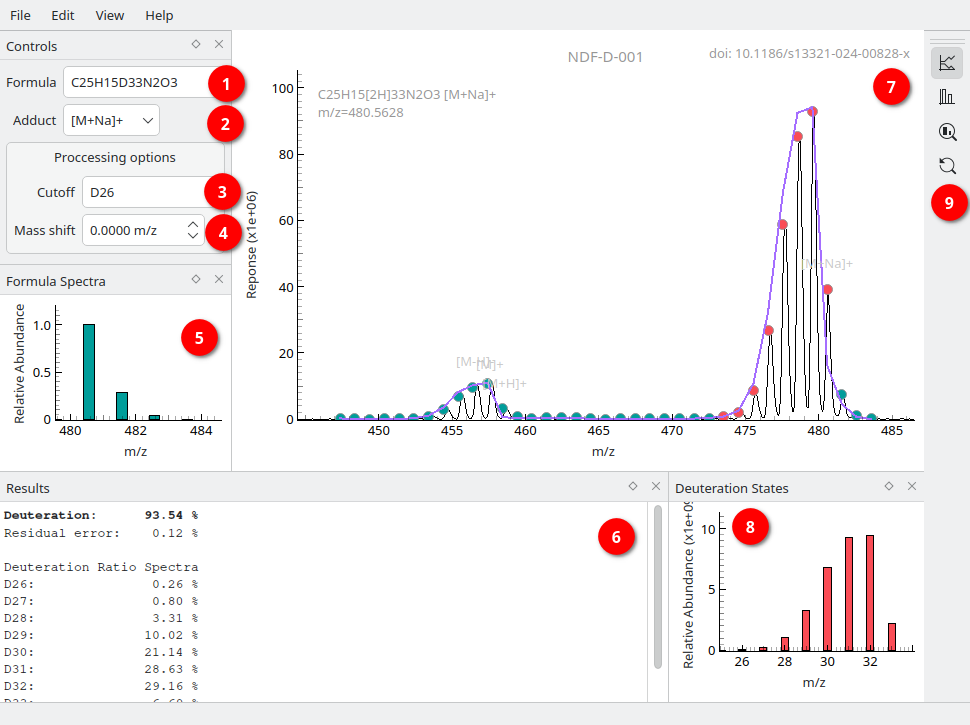

Usage
=====

DGet! is a command line tool for calculating molecule deuteration. To see a full list of CLI options, run the help::

    $ dget --help

Basic Usage
-----------

To use DGet! pass a molecular formula, mass spectra text file and optionally the adduct formed::

    $ dget C12HD8N <path-to-ms-file.csv> --adduct "[M-H]-"

This will print the deuteration of the base molecule ``%Deuteration`` and the predicted deuteration of every possible deuteration state from ``D0`` (no deuterium) to ``Dn`` (full deuterium):: 

    Formula          : C12H[2H]8N
    Adduct           : [M-H]-
    M/Z              : 175.1237
    Adduct M/Z       : 174.1164
    %Deuteration     : 93.66 %

    Deuteration Ratio Spectra
    D0               :  0.15 %
    D1               :  0.18 %
    D2               :  0.20 %
    D3               :  0.26 %
    D4               :  0.39 %
    D5               :  1.41 %
    D6               :  6.05 %
    D7               : 27.79 %
    D8               : 63.56 %

Plotting
--------

To visualise the deuteration and mass spectrum pass ``--plot``::

    $ dget C12HD8N <path-to-ms-file.csv> --adduct "[M-H]-" --plot

This will show the deconvloved deuteration spectra in red and the predicted adduct spectra in blue.
These spectra are scaled to fit the mass data so absolute heights will not be indicative of good fit.

Plotting depends on `matplotlib <https://matplotlib.org>`_.

GUI
---

A Qt based GUI is also available and can be started using::

    $ dget-gui

Windows executables are available for each release on the DGet! GitHub `<https://github.com/djdt/dget/releases>`_.

   The main interface of the DGet! GUI. Annotated details are described below.

To get started load a file into the GUI, and input the formula of the fully deuterated compound into (1).
If the form of ion is known then it can be selected using (2), a custom adduct/fragment may also be input.
Likely adducts are highlighted in the mass spectra graph in grey text.

The lowest isotopolouge to include in the calculation of total deuterium content can be specified using (3).
Input a deuterium state as `Dx` or a m/z value. Clicking on the states in the mass spectra graph will also set this. By default the lowest state after two consecutive signals < 1% of the maximum is used.
States included in the calculation are shown in red and those excluded in green.

Once the formula (1) and adduct (2) are input the  isotopic spectra is displayed in (5).
Results are shown in text (6) and as a histogram of isotopolouge abundance in (8).

Controls for (7), such as displaying deuteration results as a line plot or a stack of isotopolouge contributions, are in the toolbar (9).

Loading data
^^^^^^^^^^^^

HRMS data files can be loaded into the DGet! GUI using the menu *File->Open HRMS Data File* or by drag-dropping a file directly into the DGet! window. This will start an import dialog where the user can input specifics about the text data format. Data files must contain a column of m/z value and column of signal responses.

The full mass spectra is then displayed in (7).

Generating reports
^^^^^^^^^^^^^^^^^^

Once the data has been processed a PDF report can be generated using *File->Generate Report*, or Ctrl+R.
Report options can be set in the settings menu *Edit->Settings*.

Web App
-------

A web application of DGet! is available at `<https://dget.app>`_.

Details on its usage can be found on the `Help <https://dget.app/help>`_ page.
